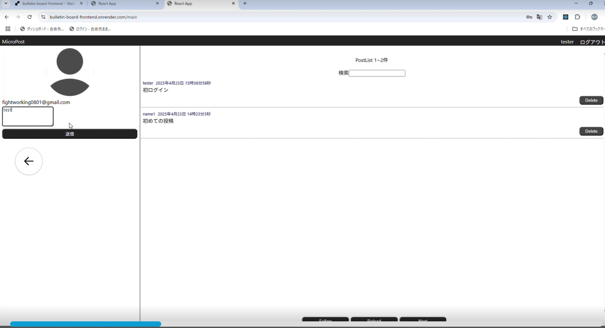

# 掲示板プロジェクト (bulletin-board-frontend)

これは、掲示板アプリケーションのフロントエンド部分のリポジトリです。
このプロジェクトは **Create React App** をベースに、**TypeScript** を使用して構築されています。

## 概要

- **目的**: 掲示板機能（スレッド一覧、書き込み、閲覧など）の UI を提供します。
- **バックエンド**: (関連するバックエンドリポジトリがあれば、ここ（例：`bulletin-board-backend`）にリンクを記載します)
- **主な使用技術**:
  - React
  - TypeScript
  - Create React App (react-scripts)

## 制作にあたっての注記

- **AI の使用について**: 本プロジェクトは学習目的であるため、AI の使用は README.md の作成のみである。

## 資料

- **フロント画面**:
  
